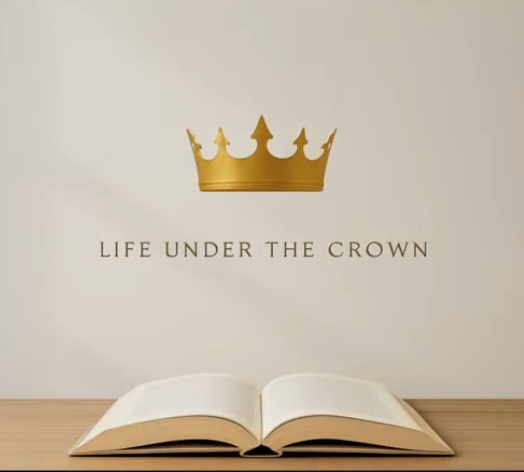

<!--hero-->

    

        

            <h1 class="text-white">Vineyard in Landsberg am Lech</h1>
            
Jeden Sonntag um 10:00 Uhr oder per <a class="text-green-200 hover:text-green-300" href="example.com">Livestream</a>
            

            
<a class="btn-primary-white">Besuchen</a>
                <a class="btn-primary-white">Mitmachen</a>
            

        

    

<!--content-->

    

        <h2>Willkommen bei Vineyard Landsberg am Lech</h2>
        <h4>Eine moderne, lebendige und internationale Gemeinde</h4>
        
Wir glauben an den dreieinigen Gott der Bibel und erleben Ihn persönlich sowie gemeinsam als Gemeinde.
            Wir ermutigen uns gegenseitig – über alle Generationen hinweg – zur Nachfolge Jesu und geben weiter, was wir
            von Gott empfangen haben. Als wachsende Evangelische Freikirche Vineyard möchten wir den Menschen in
            Landsberg dienen und insbesondere diejenigen erreichen, die Jesus noch nicht kennen. Wir sind Teil des
            internationalen Vineyard-Verbandes.

        <a class="btn-primary">Mehr über uns</a>
    

    

        <iframe
            class="border-0 w-full h-96"
            src="https://www.google.com/maps/embed?pb=!1m18!1m12!1m3!1d2665.9927992447597!2d10.8616957!3d48.0717819!2m3!1f0!2f0!3f0!3m2!1i1024!2i768!4f13.1!3m3!1m2!1s0x479c231178d2aee3%3A0x7332c354811be2df!2sEvangelische%20Freikirche%20Vineyard%20-%20Landsberg%20am%20Lech%20e.%20V.!5e0!3m2!1sen!2sde!4v1768077938136!5m2!1sen!2sde"
            width="600"
            height="450"
            allowfullscreen="allowfullscreen"
            loading="lazy">
        </iframe>
    

    

        
        <h3 class="mt-4">Jeden Sonntagvormittag für Gott</h3>
        
…das ist sehr heilsam! Denn die Sonntagvormittage mit Gott und unseren
            Mitmenschen zu verbringen baut auf und stärkt den Geist.

        
Wir feiern jeden Sonntag um 10:00 Uhr Gottesdienst mit Lobpreis, Gebet und Predigt.
            Parallel dazu finden altersgerechte Kindergottesdienste statt (Stand 04.24).

    

    

        
        <h3 class="mt-4">Christ im Alltag</h3>
        
Wir sind auch dazu aufgerufen, biblische Werte verantwortlich in Beruf, in der Nachbarschaft
            und an den Brennpunkten unserer Gesellschaft einzubringen. Ob Schulwesen, Politik, Kirche,
            Wissenschaft und Kultur, Medien oder das Rechts-, Familien- und Sozialwesen unserer Stadt:
            all diese Bereiche brauchen unsere Gebete und unser praktisches Engagement.

    

    

        
        <h3 class="mt-4">Gebetstreffen</h3>
        
Sorget nichts, sondern in allen Dingen lasset Eure Bitten im Gebet und Flehen mit Danksagung
            vor Gott kund werden. Phil. 4,6.

        
<strong>Segnendes Gebet</strong> 
            Nach jedem Gottesdienst bieten wir segnendes Gebet an für
            jeden, der dieses Angebot wahrnehmen möchte.

        
<strong>Gemeindegebet am Abend</strong> 
            Jeden Dienstag um 19:30 Uhr im Gemeindehaus.

    



    <!-- Sticky left column -->
    

        <h2 class="mt-4 text-4xl font-bold leading-tight tracking-tight text-stone-900">
            Anstehende Events
        </h2>
        

            Alle kommenden Veranstaltungen auf einen Blick.
        

        <a href="#" class="btn-primary">
            Mitmachen
        </a>
    

    

    

        
    

    

        <h2>Aktuelle Predigtreihe</h2>
        
Finde heraus, was es heißt, unter der Herrschaft Jesu zu leben.

        <a class="btn-primary">Zu den Aufzeichnungen</a>
    

